# SWORD — System Design

> **SWORD Bible Study** is a mobile-first, offline-capable Progressive Web App (PWA) built for **Realign Ministries**. It delivers Scripture reading, personal reflections, marked passages, daily Pre-Read studies, and apologetics content — backed by Supabase and deployed on Vercel.

---

## Table of Contents

1. [System Context](#1-system-context)
2. [High-Level Architecture](#2-high-level-architecture)
3. [Component Architecture](#3-component-architecture)
4. [Feature Modules](#4-feature-modules)
5. [Request & Data Flows](#5-request--data-flows)
6. [Data Model](#6-data-model)
7. [API Surface](#7-api-surface)
8. [Authentication & Authorization](#8-authentication--authorization)
9. [Offline & PWA Architecture](#9-offline--pwa-architecture)
10. [Deployment & Infrastructure](#10-deployment--infrastructure)
11. [Tech Stack](#11-tech-stack)
12. [Design Decisions & Tradeoffs](#12-design-decisions--tradeoffs)

---

## 1. System Context

SWORD sits between ministry users (readers, hosts, admins) and managed backend services. The app is a single Next.js monolith that acts as both the UI and a Backend-for-Frontend (BFF) layer.

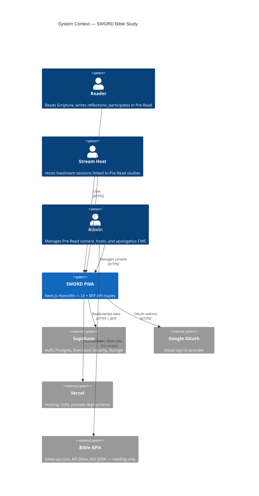

---

## 2. High-Level Architecture

The system follows a **monolithic BFF pattern**: one Next.js application serves React pages and REST API route handlers. Supabase is the managed backend (database, auth, storage). The client adds an offline layer via IndexedDB and a service worker.

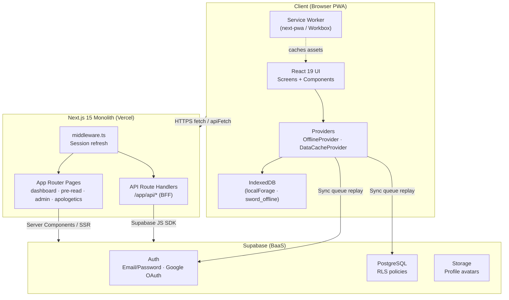

### Architectural Style

| Aspect | Choice |
|---|---|
| **Pattern** | Monolith with BFF API layer |
| **Rendering** | App Router — Server Components + Client Components |
| **State** | React context, custom `DataCacheProvider`, IndexedDB for offline |
| **Data access** | Supabase JS SDK (server + browser clients) |
| **Multi-tenancy** | Single-tenant (Realign Ministries) |

---

## 3. Component Architecture

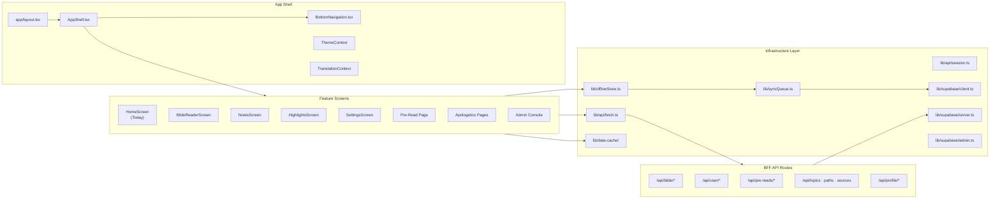

### Directory Map

```
sword/
├── app/                          # Next.js App Router
│   ├── layout.tsx                # Root: OfflineProvider + DataCacheProvider
│   ├── (admin)/admin/            # Admin console (role-gated)
│   ├── (modules)/apologetics/    # Public apologetics pages
│   ├── api/                      # 29 BFF route handlers
│   ├── auth/callback/            # OAuth code exchange
│   ├── dashboard/                # Main authenticated app
│   ├── login/                    # Auth screen
│   └── pre-read/                 # Daily Pre-Read view
├── components/                   # UI screens + shared components
│   ├── ui/                       # Radix/shadcn primitives
│   ├── pre-read/                 # Poll, comments, stream host widgets
│   └── *Screen.tsx               # Feature screens
├── lib/                          # Business logic & infrastructure
│   ├── api/                      # Client-side API wrappers
│   ├── supabase/                 # Supabase client factories
│   ├── bible/                    # Reference parsing + queries
│   ├── offline/                  # Pack manifest versioning
│   ├── data-cache/               # In-memory client cache
│   ├── memory/                   # Spaced-repetition scheduling
│   └── syncQueue.ts              # Offline mutation replay
├── types/                        # Shared TypeScript types
├── supabase/migrations/          # SQL migrations (Pre-Read)
├── public/                       # Static assets, PWA manifest, offline packs
├── scripts/                      # Bible seeding scripts
└── middleware.ts                 # Supabase session refresh
```

---

## 4. Feature Modules

### 4.1 Navigation & Information Architecture

Primary navigation (bottom bar):

| Tab | Route | Screen |
|---|---|---|
| Today | `/dashboard` | Home — daily overview, quick actions |
| Scripture | `/dashboard/reader` | Multi-translation Bible reader |
| Reflections | `/dashboard/notes` | Verse-anchored personal notes |
| Marked | `/dashboard/highlights` | Highlighted passages |
| Profile | `/dashboard/settings` | Theme, avatar, preferences |

Secondary routes (reachable but not in bottom nav):

| Feature | Route | Status |
|---|---|---|
| Pre-Read | `/pre-read` | Active |
| Apologetics | `/apologetics` | Implemented, removed from main IA |
| Memory Verses | `/dashboard/memory` | Redirects to Today (deprecated) |

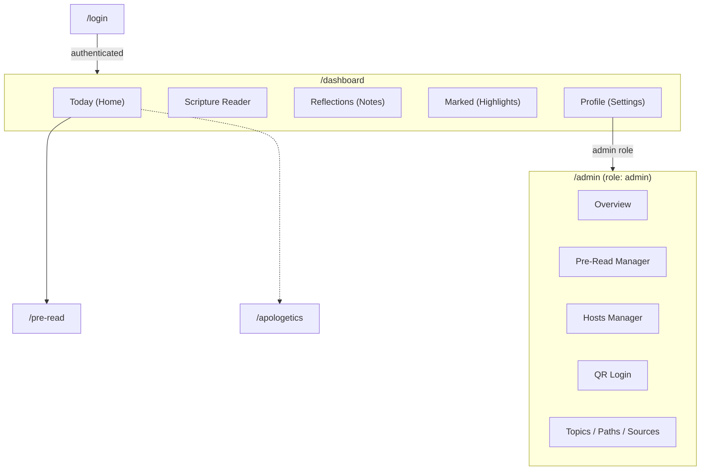

### 4.2 Module Responsibilities

| Module | Key Files | Responsibility |
|---|---|---|
| **Bible Reader** | `BibleReaderScreen.tsx`, `lib/api/bible.ts`, `lib/bible/` | Load translations, books, chapters; highlight, bookmark, create notes inline |
| **Reflections** | `NotesScreen.tsx`, `lib/api/notes.ts`, `components/notes/AudioNotePanel.tsx` | CRUD for verse-anchored notes; voice-to-text via Web Speech API |
| **Marked** | `HighlightsScreen.tsx`, `lib/api/highlights.ts` | View and manage highlighted passages |
| **Pre-Read** | `app/pre-read/`, `components/pre-read/`, `lib/api/pre-reads.ts` | Daily study content, polls, threaded comments, stream host cards |
| **Apologetics** | `app/(modules)/apologetics/`, `lib/api/apologetics.ts` | Topics, evidence, counterarguments, sources, learning paths |
| **Memory** | `MemoryScreen.tsx`, `lib/memory/scheduling.ts` | SM-2–style spaced repetition (UI exists, nav deprecated) |
| **Admin** | `app/(admin)/admin/` | Content management for Pre-Read, hosts, apologetics CMS, QR login |
| **Offline** | `OfflineProvider.tsx`, `lib/offlineStore.ts`, `lib/syncQueue.ts` | IndexedDB caching, mutation queue, pack versioning |

---

## 5. Request & Data Flows

### 5.1 Authentication Flow

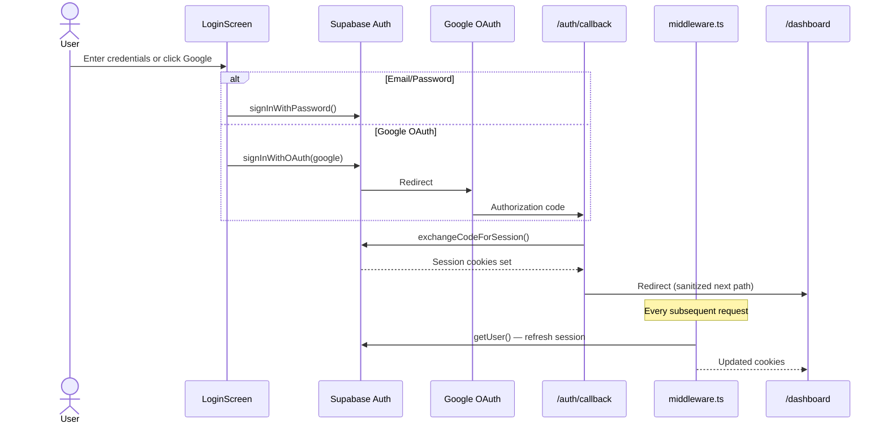

### 5.2 Authenticated API Flow (BFF Pattern)

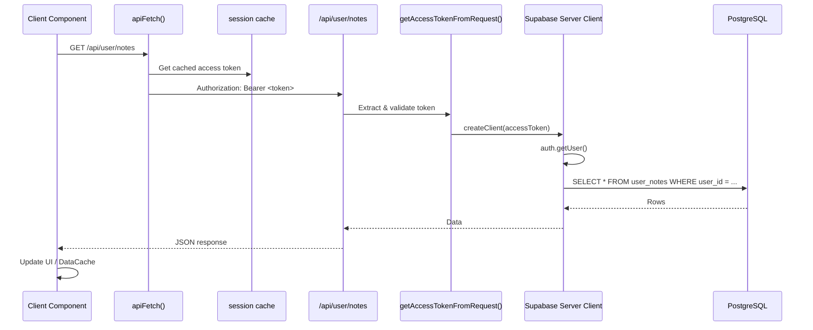

### 5.3 Bible Content Flow (Mostly Public)

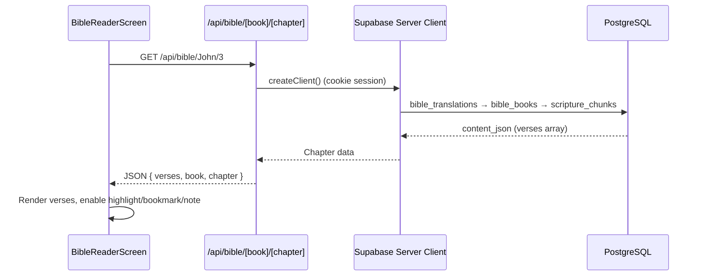

### 5.4 Offline Sync Flow

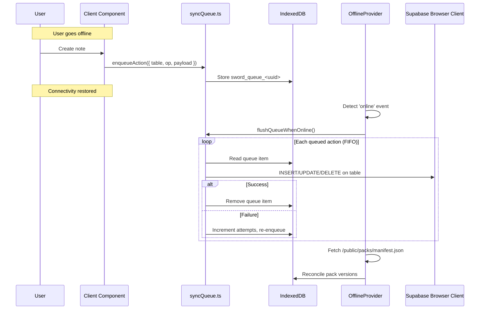

### 5.5 Pre-Read Admin → User Flow

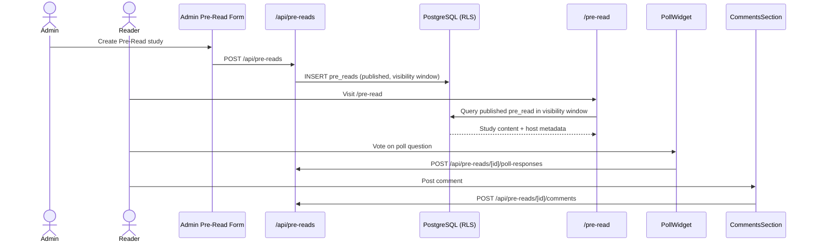

---

## 6. Data Model

### 6.1 Entity Relationship Diagram

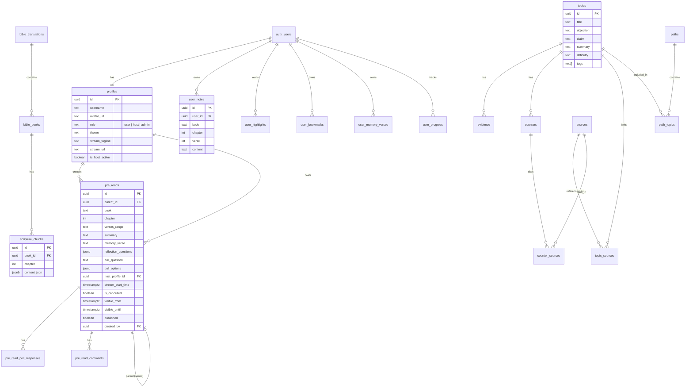

### 6.2 Table Groups

| Group | Tables | Access Pattern |
|---|---|---|
| **Bible** | `bible_translations`, `bible_books`, `scripture_chunks` | Public read; seeded via CLI scripts |
| **User Data** | `user_notes`, `user_highlights`, `user_bookmarks`, `user_memory_verses`, `user_progress` | Per-user, filtered by `user_id` |
| **Profiles** | `profiles` | 1:1 with `auth.users`; role-based access |
| **Pre-Read** | `pre_reads`, `pre_read_poll_responses`, `pre_read_comments` | RLS: published + visibility window for users; full access for admins |
| **Apologetics** | `topics`, `evidence`, `counters`, `counter_sources`, `sources`, `topic_sources`, `paths`, `path_topics` | Public read; admin write via CMS |

> **Note:** Only Pre-Read migrations exist in `supabase/migrations/`. Bible, Apologetics, and Profile schemas live in the hosted Supabase project. Generated types are in `lib/database.types.ts` (partial coverage).

---

## 7. API Surface

All API routes live under `/app/api/` and act as a BFF layer over Supabase.

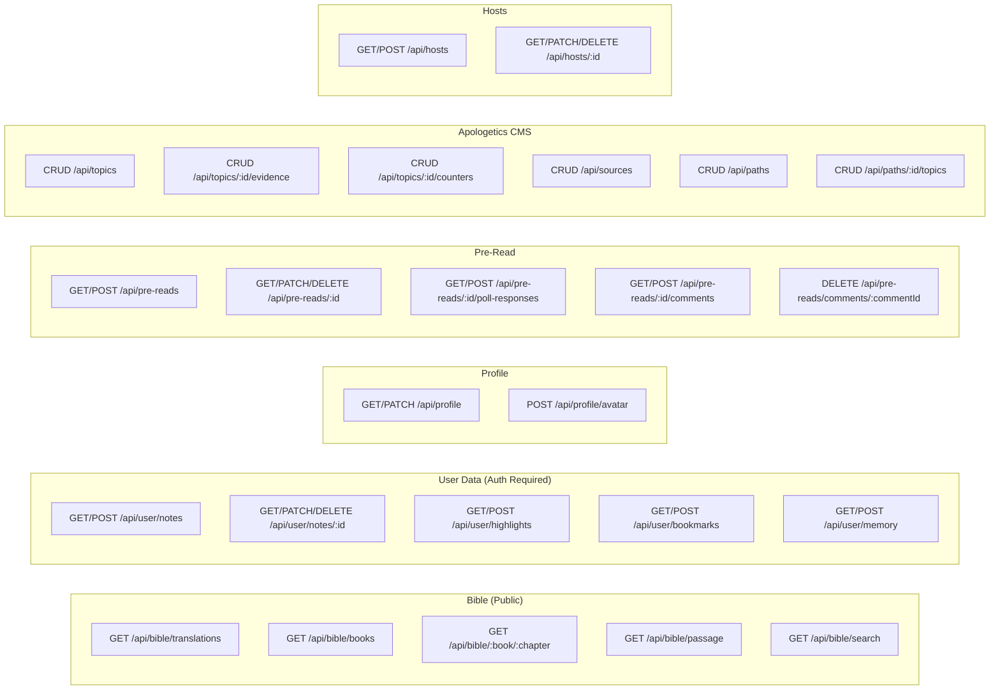

### Auth Requirements by Route Group

| Route Group | Auth Mechanism |
|---|---|
| `/api/bible/*` | Optional (cookie session) |
| `/api/user/*` | `Authorization: Bearer <access_token>` |
| `/api/profile/*` | Cookie session |
| `/api/pre-reads/*` | Mixed — public read for published; write requires auth |
| `/api/topics/*`, `/api/paths/*`, `/api/sources/*` | Supabase client (RLS-dependent) |
| `/api/hosts/*` | Auth required |

---

## 8. Authentication & Authorization

### 8.1 Auth Stack

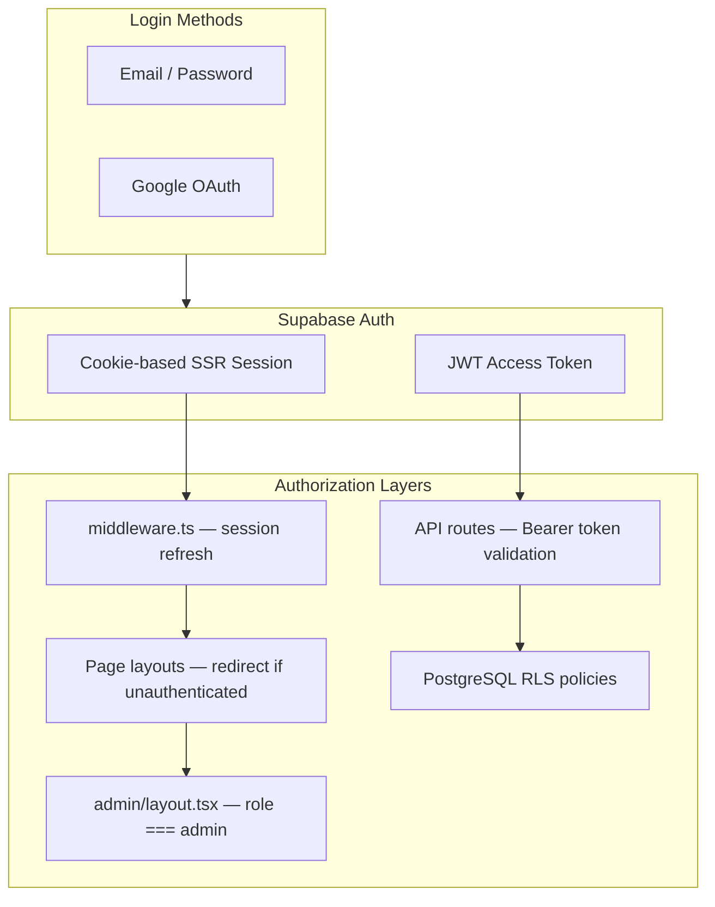

### 8.2 Role Model

| Role | Capabilities |
|---|---|
| `user` | Read Scripture, manage own notes/highlights/bookmarks, participate in Pre-Read polls/comments |
| `host` | Profile includes stream metadata (`stream_url`, `stream_tagline`, `is_host_active`) |
| `admin` | Full Pre-Read CRUD, host management, apologetics CMS, view all poll responses |

### 8.3 RLS Example (Pre-Read)

The `is_admin(uid)` helper function gates admin access. Authenticated users see only published, non-cancelled Pre-Reads within their visibility window. Poll responses are unique per user per Pre-Read.

### 8.4 Security Controls

| Control | Implementation |
|---|---|
| Session refresh | `middleware.ts` calls `supabase.auth.getUser()` on every request |
| Open redirect prevention | `sanitizeAuthNextPath()` in `lib/site-url.ts` |
| Avatar upload validation | Max 5 MB, image MIME types only |
| Service role isolation | `lib/supabase/admin.ts` — server-only, never exposed to browser |
| Storage caching | Supabase public URLs cached 7 days via service worker |

---

## 9. Offline & PWA Architecture

SWORD is designed to work without connectivity. The offline subsystem is shared infrastructure used by Bible, Apologetics, and Notes modules.

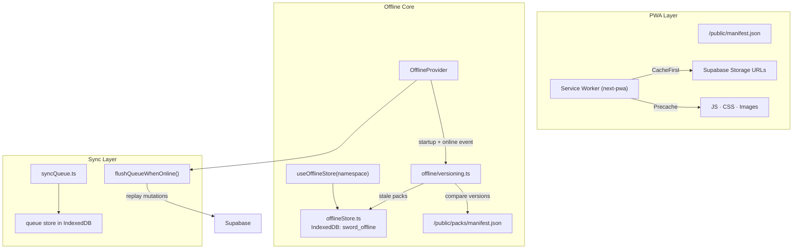

### IndexedDB Key Conventions

| Key Pattern | Purpose | Example |
|---|---|---|
| `sword_<namespace>_<id>` | Cached JSON pack | `sword_bible_default` |
| `sword_queue_<uuid>` | Pending offline mutation | `sword_queue_a1b2c3...` |
| `sword_cache_version` | Global cache version marker | — |

### Cache Invalidation

1. Bump `version` in `/public/packs/manifest.json` for a global reset
2. Update per-pack semantic versions for targeted invalidation
3. `OfflineProvider` reconciles automatically on next online session

---

## 10. Deployment & Infrastructure

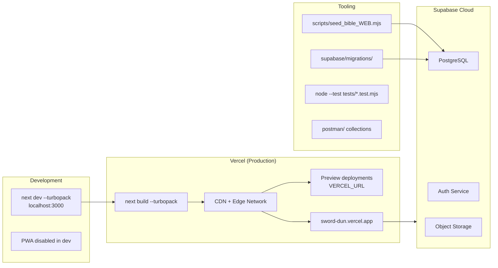

### Environment Variables

| Variable | Purpose |
|---|---|
| `NEXT_PUBLIC_SUPABASE_URL` | Supabase project URL |
| `NEXT_PUBLIC_SUPABASE_ANON_KEY` | Public anon key (browser + server) |
| `SUPABASE_SERVICE_ROLE_KEY` | Admin operations (server-only) |
| `NEXT_PUBLIC_SITE_URL` | App origin for SSR/OAuth callbacks |
| `NEXT_PUBLIC_PROD_URL` | Production URL (QR login) |
| `NEXT_PUBLIC_SUPABASE_AVATAR_BUCKET` | Avatar storage bucket name |
| `VERCEL_URL` | Auto-set on Vercel preview deploys |
| `API_BIBLE_KEY` | KJV seeding via API.Bible (scripts only) |

### CI/CD

No GitHub Actions workflows are configured. Deployment is handled by Vercel's git integration. Database migrations are applied manually via Supabase CLI or dashboard.

---

## 11. Tech Stack

| Layer | Technology | Version |
|---|---|---|
| **Runtime** | Node.js | 20+ |
| **Language** | TypeScript | 5.x |
| **Framework** | Next.js (App Router) | 15.5 |
| **UI Library** | React | 19.1 |
| **Component Primitives** | Radix UI | — |
| **Styling** | Tailwind CSS | 4.x |
| **Animation** | Motion | 11.x |
| **Icons** | Lucide React | — |
| **Toasts** | Sonner | — |
| **Backend** | Supabase (Postgres + Auth + Storage) | — |
| **Auth SDK** | @supabase/ssr + @supabase/supabase-js | 0.7 / 2.58 |
| **Offline Storage** | localForage (IndexedDB) | 1.10 |
| **PWA** | next-pwa (Workbox) | 5.6 |
| **Bundler** | Turbopack | (via Next.js) |
| **Testing** | Node built-in test runner | — |
| **Hosting** | Vercel | — |

---

## 12. Design Decisions & Tradeoffs

### Decisions

| Decision | Rationale |
|---|---|
| **Monolith over microservices** | Small team, single deployable unit; Supabase handles backend complexity |
| **BFF API routes over direct Supabase from browser** | Centralized auth validation, consistent error handling, hides schema details |
| **IndexedDB + sync queue over full CRDT** | Simpler mutation replay; sufficient for notes/highlights/bookmarks |
| **Custom DataCacheProvider over React Query** | Lightweight in-memory cache with prefetch; no external dependency |
| **Cookie sessions + Bearer tokens** | Cookies for SSR/page auth; Bearer tokens for client-side API calls |
| **PWA over native app** | Single codebase, installable, offline-capable; lower distribution cost |

### Known Gaps & Considerations

| Area | Status |
|---|---|
| **Schema migrations in repo** | Only Pre-Read tables migrated locally; Bible/Apologetics/Profiles schemas exist in Supabase but aren't fully mirrored |
| **Apologetics CMS auth** | API routes rely on Supabase RLS; explicit admin checks not in all route handlers |
| **Memory Verses** | Feature implemented but removed from navigation |
| **Apologetics** | Feature implemented but removed from main information architecture |
| **Admin IA** | Topics/Paths/Sources admin pages exist but aren't linked from admin overview |
| **CI/CD** | No automated test/lint pipeline configured |
| **OPENAI_API_KEY** | Present in env files but unused in application code |

### Scalability Notes

- **Bible content** is read-heavy and cacheable (offline packs + CDN)
- **User data** is partitioned by `user_id` with straightforward indexing
- **Pre-Read** uses visibility windows — queries are time-bounded
- **Supabase connection pooling** handles concurrent users; Vercel serverless functions scale horizontally
- **Offline sync queue** replays FIFO with retry counters — suitable for low-to-moderate concurrent offline users

---

*Generated from codebase analysis — July 2026*
